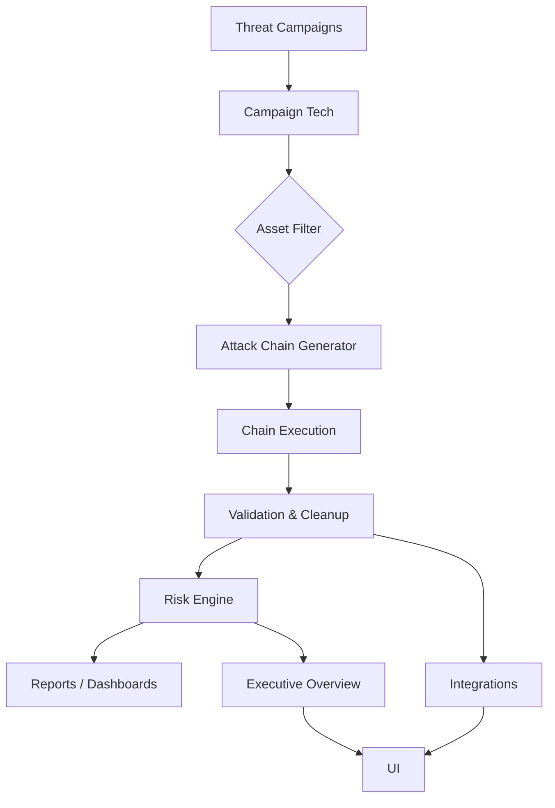

# 🎨 PurpleForge

<div align="center">
  
  <h4>A next-generation adversary simulation and risk intelligence platform</h4>
</div>

> PurpleForge transforms attack technique execution into measurable detection coverage, collaborative exercises,
> and executive‑level risk insights — all within a multi‑tenant, enterprise-ready architecture.


---

## 🚀 Quick Start

```bash
# build & run all services
docker-compose up -d --build

# initialize database (first run)
python -m app.db.init_db
```

Access the API at `http://localhost:8000` and explore the interactive docs at `http://localhost:8000/docs`.

---

---

## 📌 Feature Highlights

The development of PurpleForge has been divided into deliverable milestones. Each one adds a layer of capability to the platform.

### Milestone 1 – Execution Tracking ✅
- CLI wrapper for Stratus Red Team techniques
- Asynchronous task execution via Celery & Redis
- PostgreSQL tracking of technique runs and validation
- Basic REST API & Docker deployment

### Milestone 2 – DAG Attack Chains & Cleanup 🧩
- Define multi-stage attack chains (DAG model)
- Conditional branching between nodes
- Cleanup verification hooks with failure enforcement

### Milestone 3 – Validation & Coverage 🔍
- Store SIEM validation results per execution
- Generate structured coverage reports
- Risk scoring introduced in Spec‑3 for enterprise

### Milestone 4 – Collaboration & RBAC 🤝
- Multi-tenant architecture with row-level security
- Exercises, comments, audit logs, and role-based access control

### Spec‑3: Enterprise Platform 🌐
Detailed below with five sub-milestones that transform the tool into a full adversary simulation intelligence platform.

#### M1 – Campaign Ingestion
Import threat campaigns (STIX-style) and map MITRE techniques.

#### M2 – Auto-chain Generation
Automatically build attack chains from campaigns filtering by environment and asset compatibility.

#### M3 – Risk Scoring Engine
Calculate per-technique risk using:

```
Risk = Likelihood × Impact × Detection Gap
```


#### M4 – Stack Integrations
Integrate with webhooks, SIEM, SOAR, ticketing systems (Jira/ServiceNow), and broadcast events.

#### M5 – Executive Reporting ✅
Provide high-level dashboards and API endpoints tailored for leadership.

---

## 🗺 Architecture Overview



*Figure: High-level flow from campaign ingestion to executive reporting.*

---

## 📂 Directory Structure

```
app/
├─ api/v1/endpoints  # FastAPI routes
├─ models            # SQLAlchemy models
├─ services          # Business logic (intel, risk, chain gen, integrations)
├─ tasks             # Celery tasks
├─ static            # Frontend dashboard assets
└─ schemas           # Pydantic models
```

---

## 💡 Usage Examples

<details><summary>Register a Technique</summary>

```bash
curl -X POST "http://localhost:8000/api/v1/techniques/" \
     -H "Content-Type: application/json" \
     -d '{
       "name": "Stop CloudTrail Logging",
       "description": "Simulates stopping an AWS CloudTrail trail",
       "mitre_id": "aws.defense-evasion.cloudtrail-stop"
     }'
```

</details>

<details><summary>Generate Executive Report</summary>

```bash
curl "http://localhost:8000/api/v1/executive/report"
```

</details>

---

## 📊 Dashboard Screenshots


---

## 📦 Deployment

A `docker-compose.yml` is included to launch API, Celery workers, Redis, and PostgreSQL:

```bash
docker-compose up -d --build
```

---

## 🙌 Contribution

Open issues and PRs are welcome! Follow the project's style guide and ensure tests pass.

---

&gt; PurpleForge is licensed under the MIT License. Build, simulate, and defend with confidence.

## Quick Start (with Docker)

1. **Install requirements** (if running locally):
   ```bash
   pip install -r requirements.txt
   ```

2. **Run infrastructure & application (Automatically initializes DB)**:
   ```bash
   docker-compose up -d --build
   ```

3. **Access the API**:
   - Web API: `http://localhost:8000`
   - Interactive Docs (Swagger): `http://localhost:8000/docs`

## Usage Examples

### 1. Register a Technique
```bash
curl -X POST "http://localhost:8000/api/v1/techniques/" \
     -H "Content-Type: application/json" \
     -d '{
       "name": "Stop CloudTrail Logging",
       "description": "Simulates stopping an AWS CloudTrail trail",
       "mitre_id": "aws.defense-evasion.cloudtrail-stop"
     }'
```

### 2. Trigger an Execution (Async)
```bash
curl -X POST "http://localhost:8000/api/v1/executions/" \
     -H "Content-Type: application/json" \
     -d '{"technique_id": 1}'
```

### 3. Check Status
```bash
curl "http://localhost:8000/api/v1/executions/1"
```

## Architecture
- **FastAPI**: Core REST API
- **Celery + Redis**: Task queue for simulation detonation
- **PostgreSQL 16**: Persistence of techniques and execution metadata
- **Stratus Red Team**: The underlying engine for simulated attacks
